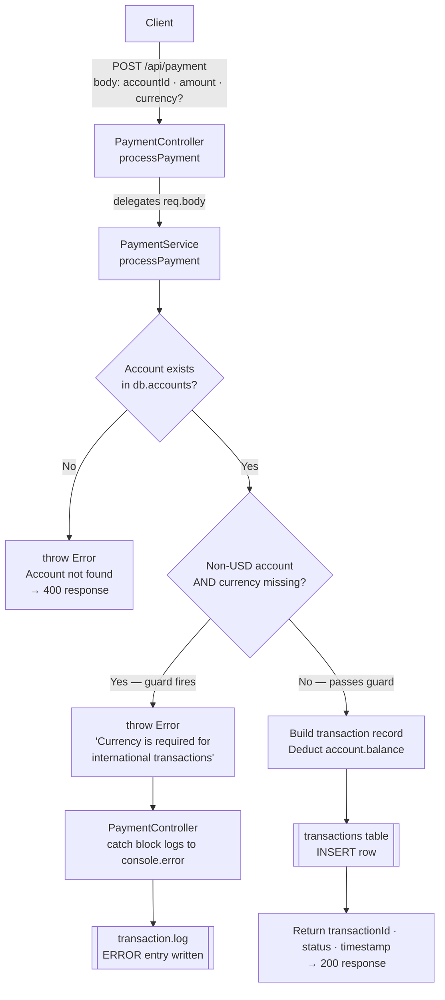

# Protocol Archaeologist — Ground-Truth Report
> Generated from live source analysis of `demo/legacy-system/`

---

## 1. System Topology Map

Runtime payment flow reconstructed from
[`PaymentController.js`](demo/legacy-system/controllers/PaymentController.js) and
[`PaymentService.js`](demo/legacy-system/services/PaymentService.js):



---

## 2. Ground-Truth Protocol Specification

True runtime contract of `POST /api/payment`, derived from
[`PaymentService.js`](demo/legacy-system/services/PaymentService.js:36) and
[`schema.sql`](demo/legacy-system/database/schema.sql):

```json
{
  "$schema": "http://json-schema.org/draft-07/schema#",
  "title": "POST /api/payment — Ground-Truth Contract",
  "description": "Runtime contract as implemented in PaymentService.processPayment(). Diverges from legacy-api.md documentation.",
  "type": "object",
  "required": ["accountId", "amount"],
  "properties": {
    "accountId": {
      "type": "string",
      "description": "ID of the account to debit. Must match an entry in db.accounts.",
      "example": "2"
    },
    "amount": {
      "type": "number",
      "description": "Transaction amount in the resolved currency."
    },
    "currency": {
      "type": "string",
      "minLength": 3,
      "maxLength": 3,
      "description": "ISO 4217 currency code. CONDITIONALLY MANDATORY: must be supplied when the target account's native currency is not 'USD'. Omitting it for a non-USD account throws Error('Currency is required for international transactions') and results in a 400 response. For USD accounts the field is genuinely optional; the service falls back to account.currency.",
      "enum": ["USD", "EUR", "GBP", "JPY"],
      "x-runtime-guard": {
        "condition": "!currency && account.currency !== 'USD'",
        "throws": "Error('Currency is required for international transactions')",
        "source": "demo/legacy-system/services/PaymentService.js:36-38"
      }
    }
  },
  "responses": {
    "200": {
      "description": "Payment accepted and committed to transactions table.",
      "schema": {
        "transactionId": "number",
        "status": "string — always 'completed' on success",
        "timestamp": "string — ISO 8601"
      }
    },
    "400": {
      "description": "Validation or business-rule failure.",
      "schema": {
        "success": false,
        "error": "string — runtime error message"
      }
    }
  }
}
```

### Discrepancy: Documentation vs. Runtime

| Field | `legacy-api.md` (docs) | `PaymentService.js` (runtime) |
|---|---|---|
| `currency` optionality | `// Optional — defaults to USD` | **Mandatory for non-USD accounts** — throws if absent |
| Guard condition | Not mentioned | `if (!currency && account.currency !== 'USD')` |
| Error raised | Not documented | `Error('Currency is required for international transactions')` |
| DB column nullability | — | `transactions.currency VARCHAR(3) NOT NULL` — column is non-nullable |

---

## 3. Archaeological Evolution

- **2021 — Initial Launch**
  - `POST /api/payment` introduced with two required fields: `accountId` and `amount`.
  - `currency` treated as fully optional across all account types; defaults silently to `account.currency`.
  - Documentation in [`legacy-api.md`](demo/legacy-system/docs/legacy-api.md) written at this time: *"Currency parameter is optional and will default to USD if omitted."*
  - Database schema sets `accounts.currency DEFAULT 'USD'`, reflecting a USD-only launch.

- **2022 — Multi-Currency Patch**
  - International account support added (EUR, GBP, JPY — see `db.accounts` seed data and `legacy-api.md` supported currencies list).
  - Business rule introduced in [`PaymentService.js:36-38`](demo/legacy-system/services/PaymentService.js:36): currency is now **required** when the account's native currency is not USD.
  - `transactions.currency` column made `NOT NULL` in [`schema.sql`](demo/legacy-system/database/schema.sql:15) to enforce integrity at the DB layer.
  - **`legacy-api.md` was never updated** — it still describes `currency` as optional.
  - Test suite in [`PaymentService.test.js`](demo/legacy-system/tests/PaymentService.test.js) added to cover the new guard (test: *"should require currency for international transactions"*).

- **Current Production State — Divergence**
  - The runtime guard fires in production, as evidenced by [`transaction.log`](demo/legacy-system/logs/transaction.log):
    - `2023-02-20` — two consecutive `ERROR: Payment failed for account ACC002 — Missing currency for international transaction` entries, followed by a successful retry with currency supplied.
    - `2023-03-10` — identical failure pattern on ACC001 attempting a EUR payment without the `currency` field.
  - The public-facing documentation (`legacy-api.md`) still advertises `currency` as optional, creating a live integration trap for any client relying solely on the docs.
  - No `PaymentController` route is registered in [`server/index.js`](server/index.js) — the controller exists in the legacy demo system but is not wired into the running Express server, which exposes only `/api/health`, `/api/legacy-system/files`, and `/api/analyze`.
