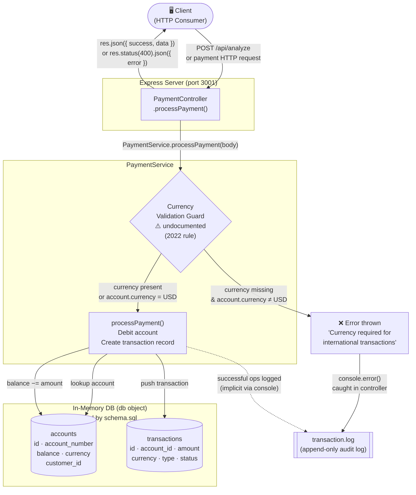

## Legacy Payment Service — Topology Map

### Component Notes

| Component | File | Notes |
|---|---|---|
| **Client** | HTTP consumer | Any caller of `POST /api/analyze` or payment endpoints |
| **PaymentController** | [`controllers/PaymentController.js`](demo/legacy-system/controllers/PaymentController.js) | Thin Express handler; delegates entirely to PaymentService |
| **PaymentService** | [`services/PaymentService.js`](demo/legacy-system/services/PaymentService.js) | Core business logic; holds in-memory `db` object |
| **Currency Validation Guard** | [`services/PaymentService.js:36`](demo/legacy-system/services/PaymentService.js:36) | **Undocumented.** Throws if `currency` is absent and account is non-USD. Introduced per a 2022 business rule; no formal documentation exists. Evidenced by repeated `ERROR: Missing currency for international transaction` entries in the log. |
| **Database** | [`database/schema.sql`](demo/legacy-system/database/schema.sql) | Schema defines `accounts` and `transactions` tables; runtime uses an in-memory JS object mirroring the same shape |
| **Transaction Logs** | [`logs/transaction.log`](demo/legacy-system/logs/transaction.log) | Append-only audit log; captures both successes and guard-triggered failures |
